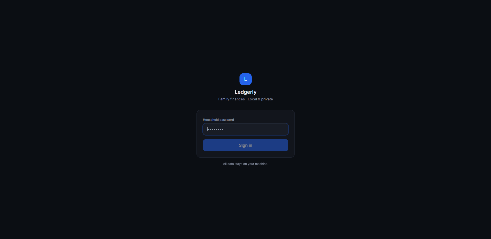
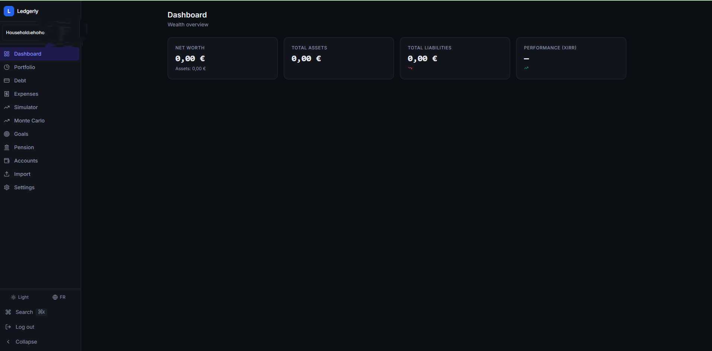
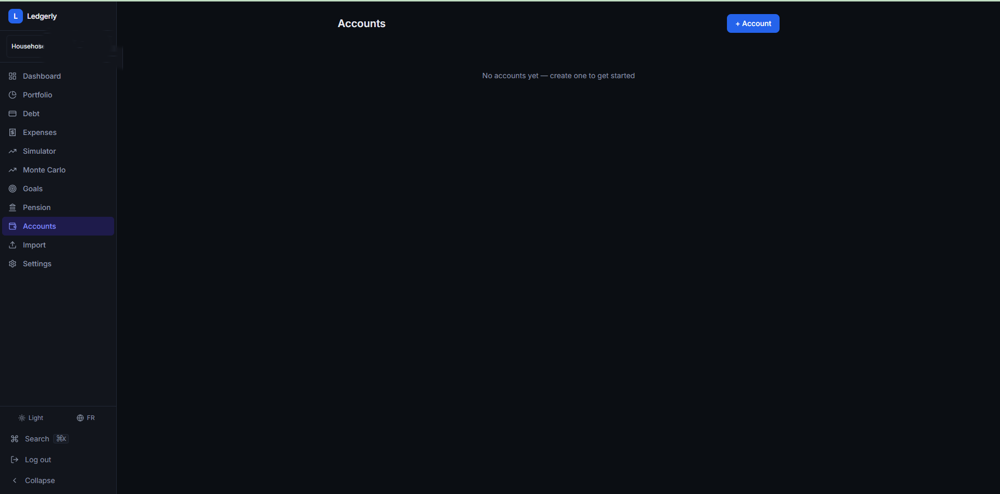
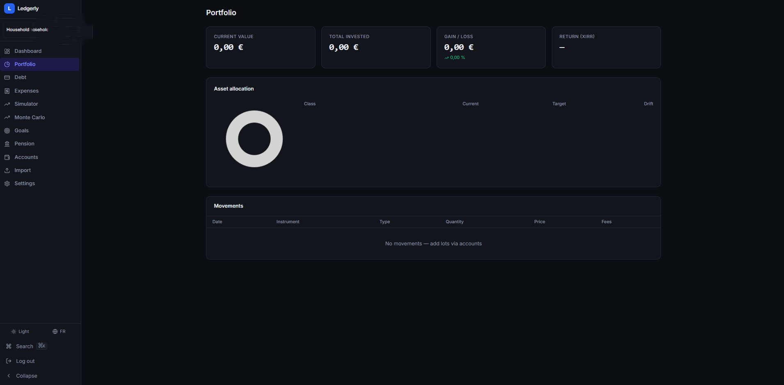
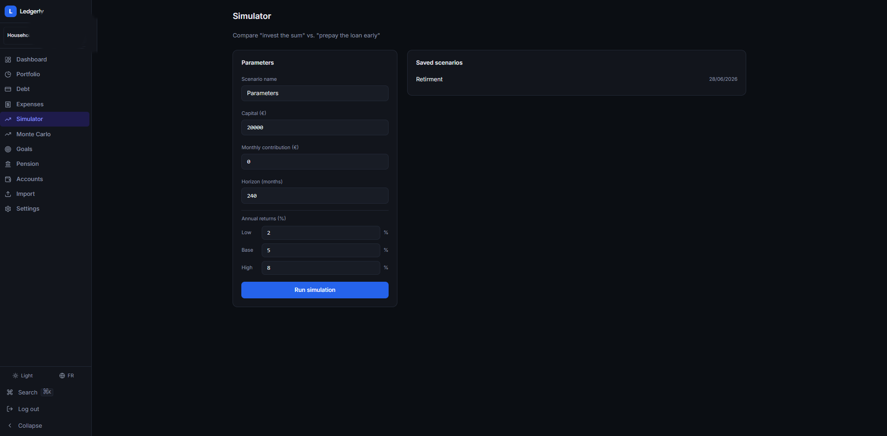
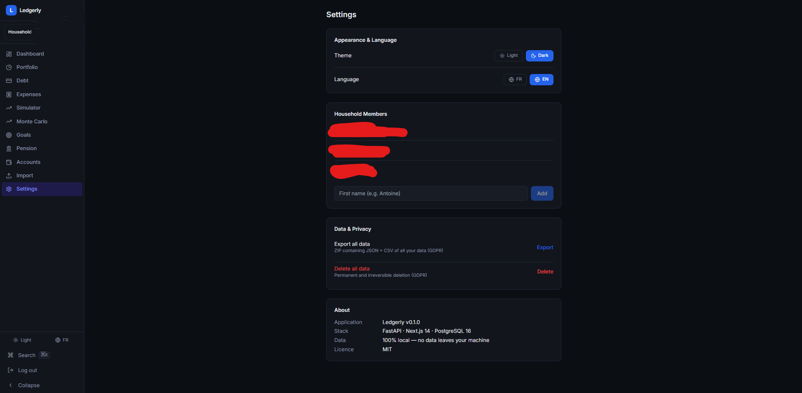

# Ledgerly

> Local-first personal finance for French households — Finary's analytics meets YNAB's control, running entirely on your own machine.

All data stays on your computer. No cloud sync, no subscriptions, no telemetry.

---

## What it does

- **Net worth** — assets, liabilities, and a monthly time-series across the whole household or per person
- **Investments** — PEA, AV, PER, PEE, CTO and other French wrappers; TWR and XIRR performance; asset allocation vs. target with drift alerts; French tax-wrapper hints (5-year PEA clock, AV 8-year threshold, etc.)
- **Loans** — full amortization schedule, interest YTD/total, prepayment recompute
- **Transactions** — CSV import from any bank (saved column mappings, sha256 dedup, batch rollback), hierarchical categories, regex auto-categorization, split transactions
- **Scenarios** — invest-vs-prepay simulator with low/base/high return assumptions and breakeven month; Monte Carlo projection (p10/p50/p90 bands across 1 000 paths)
- **Goals** — financial independence target, projected reach date, on/off-track status
- **Planning** — vacation budgets, recurring expenses
- **GDPR** — full data export (JSON + CSV ZIP) and hard erase

---

## Screenshots

<table>
  <tr>
    <td align="center"><b>Login</b></td>
    <td align="center"><b>Dashboard</b></td>
  </tr>
  <tr>
    <td></td>
    <td></td>
  </tr>
  <tr>
    <td align="center"><b>Accounts — searchable bank picker</b></td>
    <td align="center"><b>Portfolio</b></td>
  </tr>
  <tr>
    <td></td>
    <td></td>
  </tr>
  <tr>
    <td align="center"><b>Simulator</b></td>
    <td align="center"><b>Settings — Dark/Light · FR/EN</b></td>
  </tr>
  <tr>
    <td></td>
    <td></td>
  </tr>
</table>

---

## Stack

| Layer | Technology |
|---|---|
| Backend | FastAPI (Python 3.14) · Alembic · APScheduler |
| Database | PostgreSQL 17 |
| Frontend | Next.js 14 App Router · TypeScript · Tailwind CSS · ECharts · Node 24 |
| Reverse proxy | Caddy |
| Container | Docker Compose |

---

## Prerequisites

- [Docker Desktop](https://www.docker.com/products/docker-desktop/) (includes Docker Compose v2)
- Git

That's it. Python and Node are not required on the host — they run inside Docker.

---

## Quick start

### 1. Clone the repo

```bash
git clone https://github.com/your-org/ledgerly.git
cd ledgerly
```

### 2. Create the `.env` file

```bash
cp .env.example .env
```

Open `.env` and set `POSTGRES_DB` and `POSTGRES_USER` if you want to change the defaults (the file ships with sensible values already).

### 3. Set secrets

Ledgerly uses Docker secrets so that sensitive values are never in environment variables or committed to version control. Three secret files must exist before you start the stack:

```bash
mkdir -p secrets

# Database password (used by Postgres and the API)
echo "your-strong-db-password" > secrets/db_password.txt

# JWT signing secret — generate a random 64-char string
openssl rand -hex 32 > secrets/secret_key.txt

# Encryption key for at-rest encryption helpers
openssl rand -hex 32 > secrets/encryption_key.txt

# Keep these out of git (already in .gitignore)
```

### 4. Start the stack

```bash
docker compose up --build -d
```

This builds the API and web images, starts Postgres, runs Alembic migrations, and starts the Caddy reverse proxy. First build takes 2–4 minutes; subsequent starts are fast.

### 5. First-run initialization

Open your browser at **http://localhost**.

Because no password exists yet, you are automatically redirected to the **setup page** (`/auth/setup`). This happens exactly once — on every subsequent visit you go straight to the login page.

**On the setup page:**
1. Enter a password (minimum 8 characters)
2. Confirm the password
3. Click **Create password**

Ledgerly creates the household record, signs you in automatically, and redirects you to the dashboard. There is only one household and one password — there are no user accounts or roles.

After setup, go to **Settings → Members** to add household members (yourself, your spouse, etc.), then create your accounts.

> **Forgot your password?** There is no recovery flow by design (local-first, no email). Reset it by running:
> ```bash
> docker compose down -v   # drops the database volume
> docker compose up -d     # fresh start — repeat first-run setup
> ```

---

## UI features

### Dark mode / Light mode

Ledgerly ships with a full dark theme. Toggle it two ways:

- **Sidebar** — click the sun/moon icon at the bottom of the left sidebar
- **Settings → Appearance & Language** — click the Light or Dark button

The preference is saved in `localStorage` and persists across sessions and page reloads. The default theme is **light**.

### Language — FR / EN

The entire interface is available in French and English. Toggle it two ways:

- **Sidebar** — click the globe icon (shows FR / EN) at the bottom of the left sidebar
- **Settings → Appearance & Language** — click the FR or EN button

The preference is saved in `localStorage` and persists across sessions. The default language is **French (FR)**.

All UI strings — navigation labels, chart tooltips, table headers, error messages, and form placeholders — switch instantly without a page reload.

---

## Ports

| Service | Internal | External (host) |
|---|---|---|
| Caddy (HTTPS) | — | 443 |
| Caddy (HTTP redirect) | — | 80 |
| FastAPI | 8000 | not exposed |
| Next.js | 3000 | not exposed |
| Postgres | 5432 | not exposed |

Only ports 80 and 443 are exposed to the host. The API and database are internal to the Docker network.

---

## Useful commands

```bash
# View logs
docker compose logs -f api
docker compose logs -f web

# Stop the stack
docker compose down

# Stop and wipe the database volume (destructive)
docker compose down -v

# Restart after a code change
docker compose up --build -d api      # rebuild API only
docker compose up --build -d web      # rebuild frontend only

# Open a Postgres shell
docker compose exec db psql -U ledgerly ledgerly

# Regenerate the typed TypeScript client from OpenAPI
bash scripts/gen_client.sh

# Load demo data (Antoine persona — PEA, Livret A, mortgage, etc.)
docker compose exec api python scripts/seed.py
```

---

## Backup and restore

```bash
# Backup — creates backups/ledgerly_YYYYMMDD_HHMMSS.sql.gz
bash scripts/backup.sh

# Restore from a specific backup file
bash scripts/restore.sh backups/ledgerly_20260101_120000.sql.gz
```

Backups are plain gzipped SQL dumps — no proprietary format.

---

## Running tests

Unit tests (core math — no database required):

```bash
docker compose -f docker-compose.test.yml run --rm api-test \
  sh -c "pip install -e '.[dev]' -q && pytest app/tests/unit/ -v"
```

Integration tests (spins up an ephemeral Postgres in `tmpfs`):

```bash
docker compose -f docker-compose.test.yml run --rm api-test
```

Full verification pipeline (unit → integration → build → health check → backup):

```bash
bash scripts/verify.sh
```

---

## Optional: pluggable price provider

By default, no price data is fetched automatically. To enable daily end-of-day price fetching, set `PRICE_PROVIDER_URL` in your `.env`:

```
PRICE_PROVIDER_URL=https://your-provider.example.com/prices
```

The scheduler will call this endpoint daily at 18:30 UTC (after European market close), sending only ISIN codes and a date — never holdings or account data. See `api/app/infra/price_provider.py` to implement your own provider.

---

## Project structure

```
ledgerly/
├── api/                    # FastAPI backend (Python 3.14)
│   ├── app/
│   │   ├── api/            # HTTP routers
│   │   ├── core/           # Pure math (amortization, TWR, XIRR, Monte Carlo)
│   │   ├── domains/        # Business logic + DB models per domain
│   │   └── infra/          # DB, security, scheduler, settings
│   └── alembic/            # Database migrations
├── web/                    # Next.js 14 frontend (TypeScript)
│   └── src/
│       ├── app/            # Page routes (App Router)
│       ├── components/     # Shared UI components
│       └── lib/            # API client, TanStack Query hooks, formatters
├── scripts/                # backup.sh, restore.sh, seed.py, verify.sh
├── docs/PROGRESS.md        # Build tracker (all 37 stories)
├── docker-compose.yml      # Production stack
├── docker-compose.test.yml # Test stack (ephemeral DB)
└── Caddyfile               # Reverse proxy config
```

---

## Privacy

- No data ever leaves your machine (unless you explicitly configure a price provider)
- No analytics, no telemetry, no third-party SDKs that phone home
- The price provider integration is off by default and, when enabled, sends only ISIN codes — never portfolio holdings or account details
- GDPR export and hard erase are built in (Settings → Data & Privacy)

---

## License

MIT
